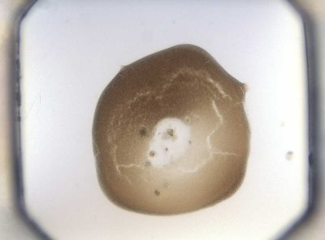
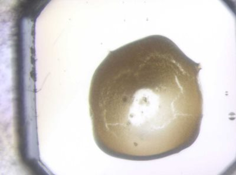

Solution
========

First Step: Image Overlay
-------------------------

The first task is to develop an algorithm that take two images of the same thing captured at different times, and to generate a single transformation that will map the gross features of the second image onto the first. The images may have different lighting, and be taken at a slightly different position.

As an example, we will take the following two images. The second (B) was taken some time later than the first (A) and it can be seen that some of the detailed features are different, and the camera position is obviously slightly offset compared to the first. However we can see that the large-scale features of the sample (the brown blob) are more-or-less unchanged.

 \s  

The goal here is to figure out the transformation that will map image B onto image A. This will be a translation of the form (-x um, -y um). The following approach for solving this problem was originally developed by Nic Bricknell (nic.bricknell@diamond.ac.uk).

First we define a metric, metric(imageA, imageB, transformation), that quantifies how closely image B matches image A when the transformation is applied to image B.