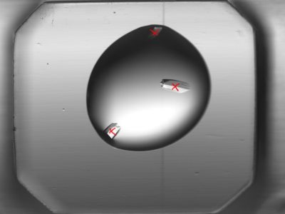
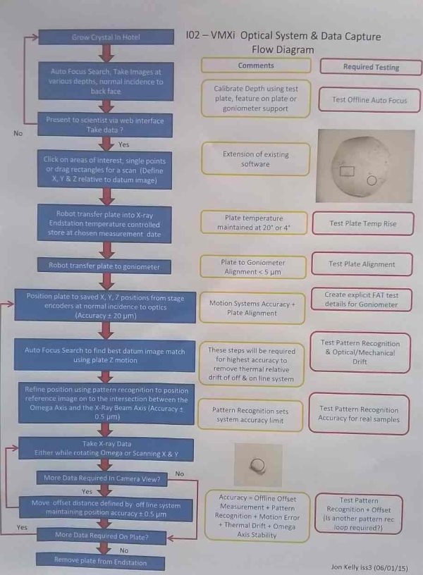

Feature Tracking
================

Target Selection
----------------

On VMXi, the width of the X-ray beam is only a few microns. Since each well is a few mm across, this means that it is not practical to scan the entirety of each well with the beam. This is both because of the amount of time that it would take and because the heat generated by doing so would quickly destroy the sample. Therefore, it is necessary to be selective about the section/s of each well that will be scanned by the beam. To this end, the beamline provides a web application that the users can make use of (remotely), that allows them to view images of their wells and mark points or areas of interest on each one so that it can be scanned.

Sample plates will be stored in a refrigerator in the beamline hutch and a robot will transfer them from the refrigerator to the beam sample chamber when required. When the plate is loaded into the fridge (and periodically after that), an image will be taken of each well in the plate. When the user access the web application, the most recent image will be shown to them for target selection.

The Problem
-----------

An issue that arises is that between the time that the user selects their targets and the time when the sample is actually scanned, it is possible for the sample in the well to move around to some degree. In the example image above, the most likely thing is that the individual crystals could move around within the bubble. This can occur due to natural motion, as well as when the sample is moved from the refrigerator to the beam. In particular there is an issue because the plates will be stored horizontally in the fridge but will be held vertically when being scanned in the beam.

It is necessary then to be able to identify the current position of any selected features/areas at the time when the sample is actually being scanned. There will be a digital camera on the beamline which will be able to take high resolution images of the sample wells just before they are scanned. Also the position of the plate can be controlled using very high precision motors (to scan the beam across the sample, the sample itself moves rather than the beam, as the beam position is fixed).

Therefore what is need is a piece of software that can compare an image taken in the fridge and one taken on the beamline, and track any movement of features that have been selected as targets by the user. This information is then translated into precise motion signals to control the position of the sample plate and make sure that the feature/s that the user selected are properly scanned by the beam.

It should be noted that during the sample growing process, the shape and appearance of any crystals (and the bubble as a whole) will change dramatically. This should hopefully occur mostly prior to the sample being placed in the fridge and the first image taken and so we needn't worry about it much.

Z-Slicing
---------
Images taken in the fridge are likely to use a Z-focusing mode where the well is imaged multiple times at different focal depths. This will probably be displayed as a single composite image to the user, though it is not particularly clear how this will be formed (James Sandy asked me if I know how to go about doing this, so it may be up to me).

When the user selects a feature, the system will need to figure out which Z-slice has the feature in best focus. This feature will be important if the scan will include rotation of the sample, as we will need to know the Z-coordinate of the crystal within the sample bubble. For planar scanning, the Z-depth wont matter much as the plate will always be normal to the beam.

I have suggested that instead (or perhaps in addition) to trying to do this automatically, we could have it set up so that once a user has selected a point or region of interest, they are then able to rapidly cycle through the Z-slices and select the one in which the feature/region is in best focus. I have suggested the possibility to James (by email). 

Real Time Constraint
--------------------

The beamline is intended to be very high throughput. The whole scanning operation for a single well should take on the order of 1 second. For this reason, the image matching algorithm needs to run very quickly. The image matching program will run on a dedicated machine, and there is budget available to use a high performance server specifically to run it if needed.

Further Details
---------------

Some points of the process are not yet defined or may be subject to change. This is because none of the actual equipment is installed yet, so we are mostly working from guesses. At the moment, the fridge images are pictures of the whole well. The image from the beamline camera is a close-up of the bubble, at least for the sample images that we have.

The real size that each image represents will be known (but isn't at the moment because we don't yet have the hardware), so will have a measure of microns per pixel. We will also know the exact position of the image so that we will know the exact real position of pixel (x,y) relative to the top-left corner of the imaged well.

It is likely that the images from the wells will be close-ups of the bubbles, not pictures of the whole well. Each well is divided into two or three small sub-regions (differs depending on the brand/type of plate); so the bubbles wont be randomly distributed but will be in reasonably defined positions. Presumably images will be labelled by the sub-region, e.g., ' Plate X39241, Well B6, Bubble 2'. Obviously the positions of the bubble will vary slightly between the fridge and beam images, but as long as we know the camera offset, this shouldn't be  a problem.

While we hope for nice clean, round bubbles with well defined crystals, this will not be the norm. The pictures can contain all kinds of crazy weirdness, including nice bubbles with weird amorphous rubbish, or no bubble at all. There are some samples on ISpyB and on various xtal-pims databases that will give us an idea of what to expect. We need to look into this in further detail.

The samples will be imaged repeatedly once they are in the fridge, however most of the data wont be of interest to us. It is only at the point where the user has marked the image for analysis that we will be interested in it. Apparently nobody has studied the long term movements of crystal features so the movement data should be kept long term so that this can be undertaken.

VMXi Workflow Diagram
---------------------

