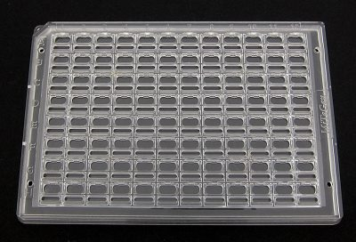
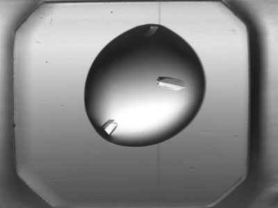

The VMXi Beamline
=================
At time of writing (Jan 2016), the VMXi beamline is currently under construction. It aims to take first light in summer 2016 and start accepting users at the end of the year (September-December 2016). The beamline is a branch of I02 and consists of a single room which is mostly empty at the moment. For more information on the beamline and construction schedule, see: <http://www.diamond.ac.uk/Beamlines/Mx/VMXi.html>.

The beamline is unusual in that the control facilities are in the same room as the beam pipe, rather than in a separate cabin. This is possible because the pipe and sample stage will all be enclosed in full shielding.

When the beamline is operational it will be fully automated. Samples will be prepared on plates in advance and stored in a refrigerator in the room. A robot on a track will move the plates from the fridge to the experiment sample stage. The sample imaging section of the beam will have a rotating beam lock so that samples can be safely introduced into the beam and it will still be safe for people to be working in the room.

The beamline will have a very high throughput. It will take on the order of a second to image a well and a minute or two to do a whole plate, and the facility will be running 24-7. Apparently one of the fridges can store about 1000 plates. Samples will be loaded manually by the beamline scientists into the fridge and the process will be automated from there on.

Users will load their plates into insulated cool boxes (like organ transplant boxes) to be sent to Diamond. They will be packed in shock absorbing blocks (presumably too much bouncing around will damage the samples). Samples will be stored at either 4C or 20C (presumably in separate fridges).

The Science
-----------
The beamline is to be used to perform macromolecular crystallography (MX), i.e., it is used to investigate the structure of large protein molecules. In MX, the X-Ray beam is pointed at a crystalline sample and the diffraction pattern that is formed by the X-Rays being scattered from the atoms in the molecule is recorded by a special X-Ray camera. Mathematical techniques are then used to infer the 3-dimensional structure of the molecule from the diffraction pattern. It is necessary for the sample to be crystalline (rather than say in solution), because the crystal structure is highly regular and each molecule will be in a fixed orientation. For more information on the technique of X-Ray crystallography, see:

 * <https://en.wikipedia.org/wiki/X-ray_crystallography>
 * <http://www.diamond.ac.uk/Science/Research/Techniques/Diffraction/MX.html>

One particularly difficult aspect of using this technique is actually getting the protein sample to form crystals. The conditions required for crystallisation vary considerably from protein to protein and usually cant be predicted in advance. Important conditions include protein purity, pH, concentration of protein, temperature, precipitates, and additives. The simplest way to find the correct conditions is to just try a set of different combinations of conditions and check which of them lead to crystallisation. In addition to structure determination, the other job of the VMXi beamline will be high-throughput screening. This means quickly scanning a large number of samples to determine whether or not there are protein crystals present. The parameter space is very large so when a sample is found which has protein crystals, the users will take that as a starting point to optimise and find the best set of starting conditions for crystal growth. Once we have determined the conditions under which crystals will grow in this way, we can use these conditions to grow further crystals which will then be used for structure determination.

For more on protein crystallisation, see:

 * <http://www.xray.bioc.cam.ac.uk/xray_resources/whitepapers/xtal-in-action/node3.html>

While structure determination will be done on VMXi, there are some limitations in doing it this way compared to other methods. The problem is that the heating from the beam during the scanning is very destructive to the sample. Imaging can be done in lab-scale machines where it is typically done by averaging the results over many samples.

Plates and Samples
------------------
Protein crystals samples are grown on sample plates. Each plate consists of a grid of 'wells', with each well containing a separate sample (i.e., grown using a different set of conditions if we are doing screening).  Each plate is a plastic rectangle roughly 15 cm to a side. The wells are rectangular and of regular size (somewhere around 10 mm a side). There may be several different types of plates in use on the beamline but they will all be of known geometry. The image below shows a typical design, a standard 96 well plate.

An individual well looks something like the following image. The circle in the image is a bubble of solution from which the protein crystals will hopefully grow.

A bubble with crystals in may look something like the image below. However it may not always be the case that the bubble and crystals are so clean. 

